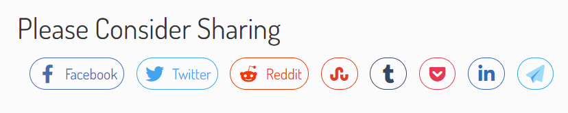
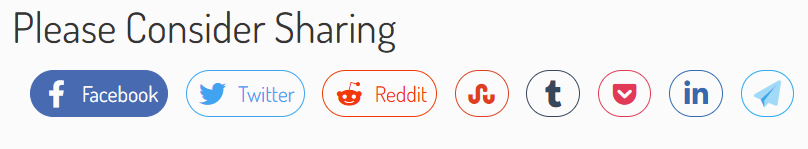

I wanted some nice, super easy share buttons for [Lutheran Answers](https://www.lutherananswers.com) that didn't break the pagespeed bank. 

The problem with share buttons, though, is that everyone wants fancy functionality. They want share counts, upvoting, etc but they don't actually know how to code. 

To solve this problem, Facebook, Twitter, and everyone else builds their own buttons.

But with those buttons come SDKs, giant JavaScript imports, CSS links, SVG images, tracking snippets, cookies, and everything else that slows down your page speed.

And getting between 95 and 100 on Pagespeed Insights is super important to me! That's 50% of the draw of building sites with Hugo and other SSGs: The near-instant load times.

So instead of doing the copy/paste thing from Facebook Developers or whatever, I decided to forgo the need for fancy post count functionality and build my own simple buttons.

These buttons worked so well that I use them on this site as well.

### Step One

Step number one was to grab all of the social share links and add Hugo's `GoLang` placeholders:

```html
https://www.facebook.com/sharer.php?u={{ .Permalink }}
https://twitter.com/share?url={{ .Permalink }}&text={{ .Title }}&via=@lutherananswers
https://www.linkedin.com/shareArticle?url={{ .Permalink }}&title={{ .Title }}
https://www.tumblr.com/share/link?url={{ .Permalink }}&name={{ .Title }}&description=[post-desc]
https://reddit.com/submit?url={{ .Permalink }}&title={{ .Title }}
https://www.stumbleupon.com/submit?url={{ .Permalink }}&title={{ .Title }}
https://getpocket.com/save?url={{ .Permalink }}&title={{ .Title }}
mailto:?subject={{ .Title }}&body=Check out this article on Lutheran Answers: {{ .Permalink }}
```

Easy enough.

### Step Two: Build the share link

Now I needed to build the actual share link and necessary structure. I came up with the following:

```html
<h3>Please Consider Sharing</h3>
<span class="social-share">

  <a href="<SPECIFIC_LINK>" target="_blank" class="<SPECIFIC_CLASS>">
    <i class="fab fa-<SPECIFIC_ICON> fa-fw fa-lg"></i>
  </a>
</span>
```
I have my heading as an h3. I could probably atomize it a bit more by setting the social share text as a `.Site.Param` in my `config.yaml` file, but this theme is a one-time, personal-use thing. I should get in the habit, I guess, but I'm a bad programmer. So I don't.

#### A note about the icons...

I use [FontAwesome](https://www.fontawesome.com) for all my web development projects. People like to tout all their fancy free libraries, but FA is the best one out there. And, if you actually *pay* for it, you can get all kinds of neat benefits like *only loading in the icons your site uses*. Pretty nifty.

Anyway, now that we have our basic structure, it's time to add CSS.

### Step 3: CSS

I write all my CSS in Sass because it's easier for me to follow via nesting than all the weird declarative nonsense you have to do with regular CSS. That in mind, here's my base CSS:

```scss
.social-share {
  display: flex;
  flex-direction: row;
  justify-content: space-evenly;
  flex-wrap: wrap;

  a {
    border-radius: 25px;
    padding: 0.25rem 0.5rem;
    background: $white;
    border: 1px solid transparent;
    transition: background ease 0.3s, color ease 0.3s;
    margin-bottom: 1em;

    &::before {
      display: none;
    }
  }

  [...]
```
I define the basic shape, spacing, transitions, etc by targeting the parent (`.social-share`) and then any anchor elements under that parent. The next part is to style the individual icons. Those are all the same, just with various hex codes, so I'll only put the facebook one here:
```scss
  .facebook {
    border-color: #4267B2;
    color: #4267B2;

    &:hover {
      background: #4267B2;
      color: $white;
    }
  }
```
####  Brand Colors

For the brand colors I just hopped over to [https://brandcolors.net/](https://brandcolors.net/) and did a `ctrl+f` for the brands I needed, and copied the relevant hex code. For email I just picked something matching my own branding. Easy enough.

### Putting it all together

The last step was slam the proper SVG into the link, copy+paste the hypertext reference, and we had some awesome social share buttons! Here they are again, along with what it looks like when you hover them:





### Full Code

Here is the Full HTML:
```html
<h3>Please Consider Sharing</h3>
<span class="social-share">

  <a href="https://www.facebook.com/sharer.php?u={{ .Permalink }}" target="_blank" class="facebook">
    <i class="fab fa-facebook-f fa-fw fa-lg"></i>
    &nbsp;Facebook
  </a>

  <a href="https://twitter.com/share?url={{ .Permalink }}&text={{ .Title }}&via=@lutherananswers" target="_blank" class="twitter">
    <i class="fab fa-twitter fa-fw fa-lg"></i>
    &nbsp;Twitter
  </a>

  <a href="https://reddit.com/submit?url={{ .Permalink }}&title={{ .Title }}" target="_blank" class="reddit">
    <i class="fa-brands fa-reddit-alien fa-fw fa-lg"></i>
    &nbsp;Reddit
  </a>

  <a href="https://www.stumbleupon.com/submit?url={{ .Permalink }}&title={{ .Title }}" target="_blank" class="stumbleupon">
    <i class="fa-brands fa-stumbleupon fa-fw fa-lg"></i>
  </a>

  <a href="https://www.tumblr.com/share/link?url={{ .Permalink }}&name={{ .Title }}{{- with .Params.description -}}&description={{- . -}}{{- end -}}" target="_blank" class="tumblr">
    <i class="fa-brands fa-tumblr fa-fw fa-lg"></i>
  </a>

  <a href="https://getpocket.com/save?url={{ .Permalink }}&title={{ .Title }}" target="_blank" class="pocket">
    <i class="fa-brands fa-get-pocket fa-fw fa-lg"></i>
  </a>

  <a href="https://www.linkedin.com/shareArticle?url={{ .Permalink }}&title={{ .Title }}" target="_blank" class="linkedin">
    <i class="fa-brands fa-linkedin-in fa-fw fa-lg"></i>
  </a>

  <a href="mailto:?subject={{ .Title }}&body=Check out this article on Lutheran Answers: {{ .Permalink }}" target="_blank" class="email">
    <i class="fa-duotone fa-paper-plane fa-fw fa-lg"></i>
  </a>

</span>
```
And here is the full SCSS:
```scss
.social-share {
  display: flex;
  flex-direction: row;
  justify-content: space-evenly;
  flex-wrap: wrap;

  a {
    border-radius: 25px;
    padding: 0.25rem 0.5rem;
    background: $white;
    border: 1px solid transparent;
    transition: background ease 0.3s, color ease 0.3s;
    margin-bottom: 1em;

    &::before {
      display: none;
    }
  }

  .facebook {
    border-color: #4267B2;
    color: #4267B2;

    &:hover {
      background: #4267B2;
      color: $white;
    }
  }

  .twitter {
    border-color: #1DA1F2;
    color: #1DA1F2;

    &:hover {
      background: #1DA1F2;
      color: $white;
    }
  }

  .reddit {
    border-color: #FF4500;
    color: #FF4500;

    &:hover {
      background: #FF4500;
      color: $white;
    }
  }

  .stumbleupon {
    border-color: #EB471D;
    color: #EB471D;

    &:hover {
      background: #EB471D;
      color: $white;
    }
  }

  .tumblr {
    border-color: #35465C;
    color: #35465C;

    &:hover {
      background: #35465C;
      color: $white;
    }
  }

  .pocket {
    border-color: #ED4255;
    color: #ED4255;

    &:hover {
      background: #ED4255;
      color: $white;
    }
  }

  .linkedin {
    border-color: #2867B2;
    color: #2867B2;

    &:hover {
      background: #2867B2;
      color: $white;
    }
  }

  .email {
    border-color: #00A4EF;
    color: #00A4EF;

    &:hover {
      background: #00A4EF;
      color: $white;
    }
  }
}
```
### Closing Thoughts

I'm sure you could `DRY` this out some more, maybe with a `{{ range }}` of some kind. I'm honestly not too concerned with trying to figure it out, though.

Hope this helps you build your own social share buttons! Or feel free to just rip mine. 'S'all good!