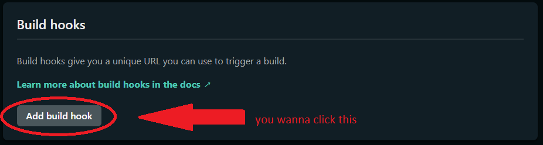
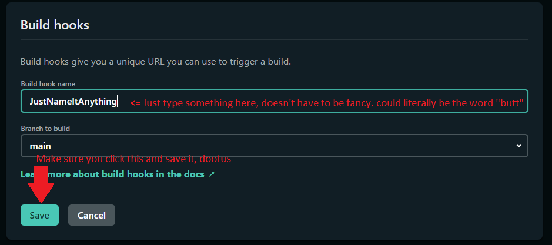
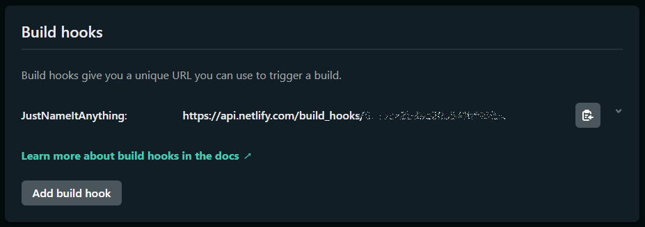
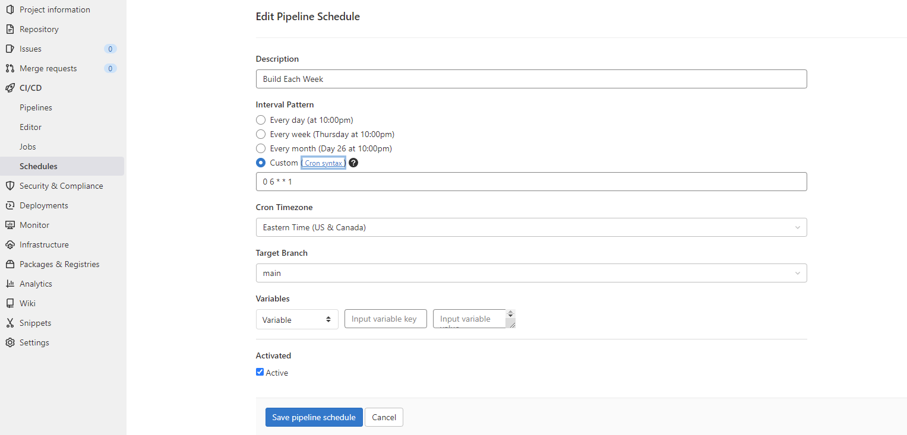

You may think that you're not able to schedule builds in Netlify but it's actually pretty straight forward. The thing about Netlify's CI/CD stuff is that it's got to be triggered from your git repo - so we just need to figure out how to get our repo to send that signal. Thankfully, both Github and GitLab have a way to do this. 

### The Hugo Side

Okay, so the first thing we need to do is pop in our Hugo configuration and change our `buildFuture` setting to `false`. If you have this set to `true` then Hugo will build a page into HTML irrespective of the publish date listed in the front matter. [Here's the relevant documentation for buildFuture](https://gohugo.io/getting-started/configuration/#buildfuture). It's not much. Literally just go into your Hugo `config` file and change `buildFuture` to `false`. If you don't see it, add it.

Here's what it looks like in YAML:

```yaml
## Copy this block and paste it in your Config.YAML file
buildfuture: false
```

And here's what it looks like in TOML:

```toml
## Copy this block and paste it in your Config.TOML file
buildFuture = false
```

wow, such code. very engineer.

The only other thing to do on the Hugo end is make sure that you have a `date` field in your front matter. No big.

### Netlify Build Hooks

A build hook in Netlify is essentially an API endpoint that, when pushed to, generates the build command. It's essentially just an incoming webhook - a listener that triggers a build/deploy action.

**[You can learn more about Netlify Build Hooks at their docs, here](https://docs.netlify.com/configure-builds/build-hooks/).**

All you're going to do here is pop over to your Netlify settings for whichever *specific site* and generate a build hook:







### Deploying using a scheduled function

This next section is going to depend on whether or not you're using GitHub or GitLab. Full disclosure: I've only done this on GitLab, but I used the below GitHub *Workflow* as a template for my GitLab *ci* function. The two things (GitHub *Workflows* and GitLab *ci* are the same concept).

Taking advantage of these things allows you to basically have a [`CRON Job`](https://en.wikipedia.org/wiki/Cron), essentially. 

#### Scheduling a deploy with GitHub

Big thank you [jonsully over on the Netlify Support Forums](https://answers.netlify.com/t/scheduling-builds-and-deploys-with-netlify/2563/19) for sharing this beautiful gem. Below you'll find a file that needs to be saved in your `.github/workflows` folder as `main.yml`. You can copy your build hook URL into the bottom there (or just replace `<YOUR_HOOK_ID>` with the string of letters and numbers on your build hook. 

The frequency of schedule is handled via cron syntax, which is outlined in the above linked wikipedia article.

If you wanted to build it every Wednesday at 10:47 am in November, for example, you would want your schedule to look like this: `47 8 * 11 3`. Other options would include building it every day in a specific month, or on a specific day of every month. I'm sure you can work it out.

Anyway, here's the code to trigger a build from GitHub to Netlify every Monday at 8:00am:

```yaml
# ./.github/workflows/main.yml

name: Trigger Netlify Build
on:
  schedule:
    - cron: '0 8 * * 1'
jobs:
  build:
    name: Request Netlify Webhook
    runs-on: ubuntu-latest
    steps:
      - name: POST to Build Hook
        run: curl -X POST -d {} https://api.netlify.com/build_hooks/<YOUR_HOOK_ID>
```

#### Scheduling with GitLab

It's a bit different with GitLab. In order to do this over there, you'll need to have a file in your `root directory` named `.gitlab-ci.yml` that contains the following code:

```yaml
image: docker:stable

services:
  - name: docker:dind

run-task:
 only:
   - schedules
 before_script:
   - apk add --update curl && rm -rf /var/cache/apk/*
 script:
   - curl -X POST -d {} https://api.netlify.com/build_hooks/<YOUR_HOOK_ID>
```

This code is a little bit different because you need to *include* the CURL package in order for it to run. You have to remember, you're essentially spooling up a *serverless function* on GitLab to push a command to Netlify. This requires you build an entire docker instance. So that's neat (and took me freaking forever to debug because I am not smart).

Also, GitLab doesn't let you specify the schedule within the YAML file that I could tell. You actually have to schedule it in a specific place on their backend. To keep you from beating your head into your desk, I've taken the time to screen shot that:



### In Conclusion

So there you have it. With this bit of code here you should be able to automatically trigger deploys from your repo to Netlify. This way you can write posts with a future `date` field, not mark them as draft, and publish to your repo. They won't be built out because they're in the future. And whenever the future rolls around, your repo will let Netlify know that it's time to rebuild your website.

Voila! Scheduled posts on a static site.

#### Some House Keeping issues....

First, let me say: I'm not sure I actually got this to work on GitLab. It's been a long time since I've needed this functionality, but I don't remember if I got it working right. According to my GitLab CI logs, I got it working. 🤷‍♂️ Your mileage may vary, but this should get you off to a running start, anyway.

Second, you'll probably need to change a few more Netlify settings than I outlined here. Mostly stuff around what triggers a deploy on Netlify (you may not want it automatically building on a new commit, for example). 

As far as I can tell, scheduled deploys are not a Netlify thing yet, and this is the way it has to be done.
